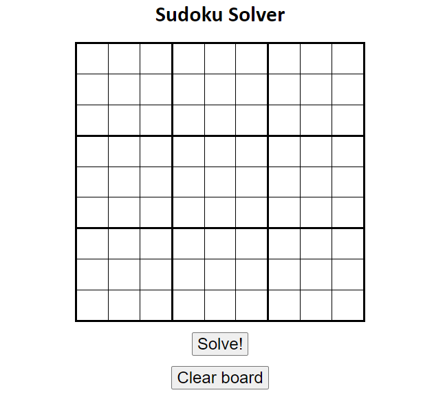
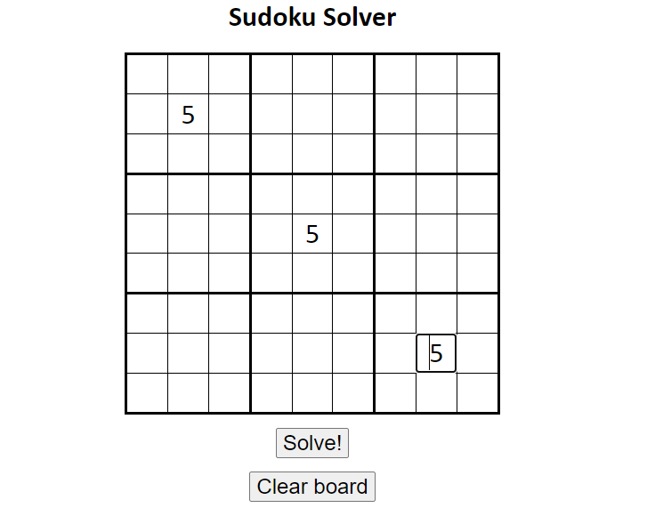
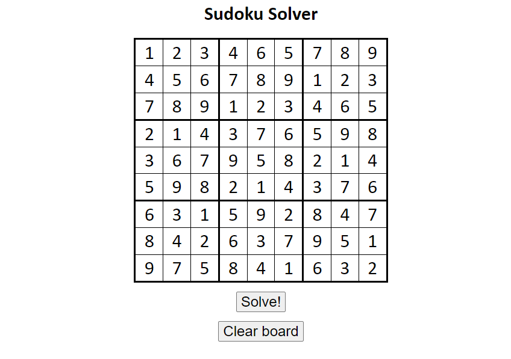
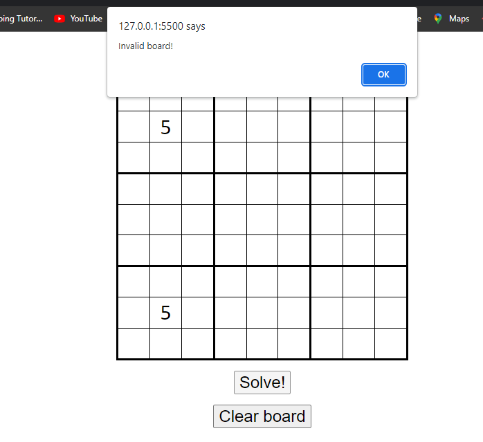

## Introduction:
-	Sudoku is one of the most popular logic-based number-placement puzzle game. The literal meaning of "Su-doku" in Japanese is "the number that is single".

-	The objective is to fill a nine-by-nine (9x9) grid with digits so that each row, column and 3x3 section contain number between 1 and 9, with each number used once and only once in each section. The Sudoku game players are provided with partially filled grid meant to be solved.

-	To solve sudoku one doesn't require the knowledge of mathematics but require the logic and reasoning. Solving Sudoku Puzzles daily helps with your brain. It improves the concentration and logical thinking. One can look for sudoku puzzles given in Newspapers or can play them online provided by many websites. 

## About:

This Script is a Sudoku Solver that solves almost any Sudoku Puzzle by visualizing through the Backtracking Algorithm . Ever tried but stucked on Sudoku Puzzles given in newspapers, magazines and online. You can use this script to get its solution instantly and move further.

## Working:

-	Every time this Script is executed, a Random Solvable board is created.
-	Now, the user can first try to attempt solving it by clicking on the cells and entering values manually. Check the Input Section for the same.
-	Once the the user finalizes that the inputted number is the correct entry, pressing the enter key will attempt to input the number onto the board. 
-	Correct answers will be permanently displayed while incorrect answers will be removed. 
-	Likewise, values can be removed by pressing on the backspace or delete keys.

# Screenshots

